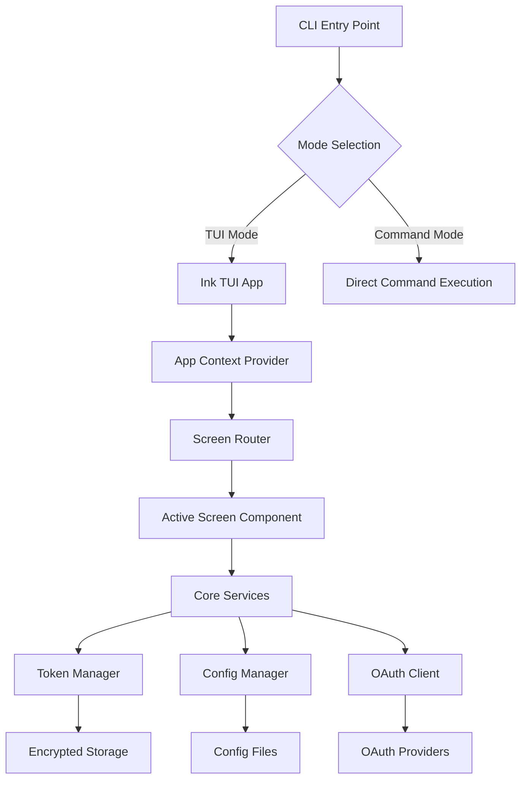

# Terminal User Interface (TUI) Implementation Plan

## OAuth CLI Tool Enhancement

---

## Table of Contents

1. [Executive Summary](#executive-summary)
2. [Technical Architecture](#technical-architecture)
3. [Implementation Phases](#implementation-phases)
4. [Component Specifications](#component-specifications)
5. [User Interface Mockups](#user-interface-mockups)
6. [Migration Strategy](#migration-strategy)
7. [Testing Strategy](#testing-strategy)
8. [Performance Considerations](#performance-considerations)
9. [Accessibility Implementation](#accessibility-implementation)
10. [Development Timeline](#development-timeline)
11. [Dependencies and Tools](#dependencies-and-tools)
12. [Risk Assessment](#risk-assessment)

---

## Executive Summary

### Project Overview

The OAuth CLI Tool currently provides a basic interactive mode using Inquirer.js for menu-driven operations. This implementation plan outlines the enhancement to a full-featured Terminal User Interface (TUI) using Ink (React-based TUI framework) with @clack/prompts for enhanced user experience.

### Business Justification

**Why TUI Enhancement?**

- **Improved User Experience**: Rich, responsive interface with real-time updates and visual feedback
- **Better Information Architecture**: Multi-panel layouts for simultaneous data viewing
- **Enhanced Productivity**: Keyboard shortcuts, quick actions, and context-aware interfaces
- **Modern Developer Tools Standard**: Align with contemporary CLI tools like k9s, lazygit, and htop
- **Accessibility**: Better screen reader support and keyboard navigation

### Key Benefits

1. **Real-time Updates**: Live token status, expiration monitoring, and OAuth flow progress
2. **Enhanced Visualization**: Syntax highlighting, structured data display, and progress indicators
3. **Improved Navigation**: Tabbed interfaces, breadcrumbs, and quick-access menus
4. **Better Error Handling**: Contextual error messages with suggested actions
5. **Comprehensive Help System**: Interactive help with searchable documentation

### Project Scope

- Replace current Inquirer-based interactive mode with Ink TUI
- Maintain backward compatibility with CLI command interface
- Implement accessibility features for screen readers
- Add comprehensive keyboard navigation
- Create modular, testable component architecture

---

## Technical Architecture

### Technology Stack Selection

**Primary Framework: Ink (React-based TUI)**

- **Rationale**: Component-based architecture, rich ecosystem, familiar React patterns
- **Version**: ^4.4.1 (Latest stable)
- **Benefits**: Hot reloading, state management, extensible component library

**Enhanced Prompts: @clack/prompts**

- **Rationale**: Modern, accessible prompt system with better UX than Inquirer
- **Version**: ^0.7.0
- **Benefits**: Consistent styling, cancellation support, group operations

**Additional Libraries**:

- `ink-select-input`: Enhanced selection components
- `ink-text-input`: Advanced text input with validation
- `ink-table`: Structured data display
- `ink-spinner`: Loading indicators
- `ink-big-text`: Large text displays for headers
- `ink-gradient`: Visual enhancements
- `react`: ^18.2.0 (Peer dependency)

### Architecture Patterns

#### Component Architecture

```typescript
src/tui/
├── components/           # Reusable UI components
│   ├── common/          # Generic components
│   │   ├── Layout.tsx   # Main application layout
│   │   ├── Header.tsx   # Application header
│   │   ├── Footer.tsx   # Status bar and shortcuts
│   │   ├── Panel.tsx    # Content panels
│   │   ├── Modal.tsx    # Dialog/modal system
│   │   └── Loading.tsx  # Loading states
│   ├── forms/           # Form components
│   │   ├── TokenForm.tsx
│   │   ├── ConfigForm.tsx
│   │   └── ProviderForm.tsx
│   └── displays/        # Data display components
│       ├── TokenList.tsx
│       ├── TokenDetails.tsx
│       ├── JWTInspector.tsx
│       └── CommandHistory.tsx
├── screens/             # Full-screen components
│   ├── MainMenu.tsx     # Main navigation
│   ├── AuthFlow.tsx     # Authentication wizard
│   ├── TokenManager.tsx # Token management
│   ├── ConfigManager.tsx # Configuration
│   └── Inspector.tsx    # JWT inspection
├── hooks/               # Custom React hooks
│   ├── useTokens.ts     # Token state management
│   ├── useConfig.ts     # Configuration state
│   ├── useKeyboard.ts   # Keyboard shortcuts
│   └── useResize.ts     # Terminal resize handling
├── context/             # React context providers
│   ├── AppContext.tsx   # Global application state
│   ├── TokenContext.tsx # Token-specific state
│   └── ThemeContext.tsx # UI theming
├── utils/               # TUI utilities
│   ├── colors.ts        # Color scheme definitions
│   ├── shortcuts.ts     # Keyboard shortcut mappings
│   ├── validation.ts    # Form validation
│   └── formatters.ts    # Data formatting
└── index.tsx            # TUI entry point
```

#### State Management Strategy

**Context-based State Management**

- React Context for global state (tokens, configuration, UI state)
- Local component state for ephemeral UI state
- Custom hooks for complex state logic

**State Structure**:

```typescript
interface AppState {
  currentScreen: ScreenType;
  tokens: TokenState;
  config: ConfigState;
  ui: UIState;
  history: CommandHistoryState;
}

interface TokenState {
  stored: StoredToken[];
  current: Token | null;
  isLoading: boolean;
  lastRefresh: Date | null;
}

interface UIState {
  theme: 'light' | 'dark' | 'auto';
  showShortcuts: boolean;
  panelLayout: 'single' | 'split' | 'tabs';
  notifications: Notification[];
}
```

#### Event-Driven Architecture

**Custom Event System**:

- Token state changes trigger UI updates
- OAuth flow progress events
- Configuration change notifications
- Error and success state propagation

```typescript
interface TUIEvents {
  'token:updated': { provider: string; token: Token };
  'config:changed': { provider: string; config: ProviderConfig };
  'auth:progress': { step: string; progress: number };
  'error': { code: string; message: string; context?: any };
}
```

### Data Flow Architecture



### Integration with Existing Architecture

**Minimal Core Changes Required**:

- Existing core services (TokenManager, OAuth clients, etc.) remain unchanged
- TUI acts as a new presentation layer
- Shared utilities and types between CLI and TUI modes

**Service Layer Integration**:

```typescript
// Existing services used by TUI
import tokenManager from '../../core/TokenManager.js';
import { ProviderConfigManager } from '../../providers/ProviderConfig.js';
import { OAuthClient } from '../../core/OAuthClient.js';

// TUI-specific adapters for React integration
class TUITokenService {
  constructor(private tokenManager: typeof tokenManager) {}

  async listTokens(): Promise<TokenDisplayData[]> {
    // Adapt token data for TUI display
  }

  subscribeToChanges(callback: (tokens: TokenDisplayData[]) => void) {
    // Event-driven updates for React components
  }
}
```

---

## Implementation Phases

### Phase 1: Foundation and Core Infrastructure (Week 1-2)

**Objectives**:

- Set up Ink TUI framework
- Create basic application structure
- Implement core navigation system

**Deliverables**:

#### 1.1 Project Setup

```bash
# New dependencies
pnpm add ink react@^18.2.0 @clack/prompts
pnpm add -D @types/react

# Enhanced TUI libraries
pnpm add ink-select-input ink-text-input ink-table ink-spinner
pnpm add ink-big-text ink-gradient ink-box
```

#### 1.2 Basic Application Structure

```typescript
// src/tui/index.tsx
import React from 'react';
import { render } from 'ink';
import App from './App.js';

export function startTUI(): void {
  render(<App />);
}

// src/tui/App.tsx
import React, { useState } from 'react';
import { AppContextProvider } from './context/AppContext.js';
import { Router } from './components/Router.js';
import { Layout } from './components/common/Layout.js';

export default function App() {
  return (
    <AppContextProvider>
      <Layout>
        <Router />
      </Layout>
    </AppContextProvider>
  );
}
```

#### 1.3 Core Components

- **Layout Component**: Basic header/content/footer structure
- **Router Component**: Screen navigation management
- **AppContext**: Global state management
- **Basic Theme System**: Color schemes and styling

**Success Criteria**:

- TUI application starts and displays basic interface
- Navigation between screens works
- Context providers are functional
- Basic error boundaries are in place

### Phase 2: Main Navigation and Menu System (Week 3)

**Objectives**:

- Implement main menu with full feature access
- Create navigation patterns and keyboard shortcuts
- Build reusable UI components

**Deliverables**:

#### 2.1 Main Menu Implementation

```typescript
// src/tui/screens/MainMenu.tsx
import React from 'react';
import { Box, Text } from 'ink';
import SelectInput from 'ink-select-input';
import { MenuItem } from '../types/ui.js';

const menuItems: MenuItem[] = [
  { label: '🔐 Authentication Flows', value: 'auth' },
  { label: '🎫 Token Management', value: 'tokens' },
  { label: '🔍 JWT Inspector', value: 'inspect' },
  { label: '⚙️  Configuration', value: 'config' },
  { label: '📜 Command History', value: 'history' },
  { label: '❓ Help & Documentation', value: 'help' },
  { label: '❌ Exit', value: 'exit' }
];

export function MainMenu() {
  return (
    <Box flexDirection="column">
      <BigText text="OAuth CLI" />
      <Text color="gray">Terminal User Interface</Text>
      <Box marginTop={1}>
        <SelectInput items={menuItems} onSelect={handleSelection} />
      </Box>
    </Box>
  );
}
```

#### 2.2 Keyboard Shortcut System

```typescript
// src/tui/hooks/useKeyboard.ts
import { useInput } from 'ink';
import { useAppContext } from '../context/AppContext.js';

export function useKeyboard() {
  const { navigate, showHelp } = useAppContext();

  useInput((input, key) => {
    if (key.ctrl && input === 'c') {
      process.exit(0);
    }

    if (key.escape) {
      navigate('main-menu');
    }

    if (key.f1 || input === '?') {
      showHelp();
    }

    // Screen-specific shortcuts
    switch (input) {
      case '1': navigate('auth'); break;
      case '2': navigate('tokens'); break;
      case '3': navigate('inspect'); break;
      case '4': navigate('config'); break;
      case 'h': navigate('history'); break;
    }
  });
}
```

#### 2.3 Status Bar and Help System

- **Status Bar**: Current operation, shortcuts, connection status
- **Help Modal**: Context-sensitive help with search
- **Notification System**: Success/error messages with auto-dismiss

**Success Criteria**:

- Complete main menu navigation
- All keyboard shortcuts functional
- Help system accessible from any screen
- Status information displays correctly

### Phase 3: Authentication Flow Interface (Week 4-5)

**Objectives**:

- Implement multi-step authentication wizards
- Create provider selection and configuration UI
- Build real-time OAuth flow progress tracking

**Deliverables**:

#### 3.1 Authentication Flow Wizard

```typescript
// src/tui/screens/AuthFlow.tsx
import React, { useState } from 'react';
import { Box, Text } from 'ink';
import { AuthStepProvider } from '../components/forms/AuthStepProvider.js';
import { AuthStepGrant } from '../components/forms/AuthStepGrant.js';
import { AuthStepCredentials } from '../components/forms/AuthStepCredentials.js';
import { AuthProgress } from '../components/displays/AuthProgress.js';

export function AuthFlow() {
  const [step, setStep] = useState(1);
  const [authData, setAuthData] = useState<AuthFlowData>({});

  const steps = [
    { component: AuthStepProvider, title: 'Select Provider' },
    { component: AuthStepGrant, title: 'Grant Type' },
    { component: AuthStepCredentials, title: 'Credentials' },
    { component: AuthProgress, title: 'Authentication' }
  ];

  return (
    <Box flexDirection="column">
      <Text color="blue">🔐 OAuth Authentication Flow</Text>
      <StepIndicator currentStep={step} totalSteps={steps.length} />
      <CurrentStepComponent {...authData} onNext={handleNext} />
    </Box>
  );
}
```

#### 3.2 Provider Configuration UI

- **Provider Selection**: Visual provider cards with capabilities
- **Custom Provider Form**: Dynamic form for manual provider setup
- **Configuration Validation**: Real-time validation with error feedback

#### 3.3 Real-time Progress Tracking

```typescript
// src/tui/components/displays/AuthProgress.tsx
import React, { useEffect, useState } from 'react';
import { Box, Text } from 'ink';
import Spinner from 'ink-spinner';

export function AuthProgress({ authData }: AuthProgressProps) {
  const [status, setStatus] = useState<AuthStatus>('initializing');

  useEffect(() => {
    const subscription = authService.subscribe((progress) => {
      setStatus(progress.status);
    });

    return () => subscription.unsubscribe();
  }, []);

  return (
    <Box flexDirection="column">
      <Box>
        <Spinner type="dots" />
        <Text> Authenticating with {authData.provider}...</Text>
      </Box>

      {status === 'device-code' && (
        <DeviceCodeDisplay code={authData.deviceCode} />
      )}

      {status === 'browser-opened' && (
        <Text color="yellow">
          Please complete authentication in your browser
        </Text>
      )}
    </Box>
  );
}
```

**Success Criteria**:

- Complete authentication flows for all grant types
- Real-time progress updates during OAuth flows
- Browser integration for authorization code flow
- Proper error handling and recovery options

### Phase 4: Token Management Interface (Week 6)

**Objectives**:

- Build comprehensive token management UI
- Implement token lifecycle visualization
- Create batch operations for token management

**Deliverables**:

#### 4.1 Token List and Overview

```typescript
// src/tui/screens/TokenManager.tsx
import React, { useState } from 'react';
import { Box } from 'ink';
import { TokenTable } from '../components/displays/TokenTable.js';
import { TokenDetails } from '../components/displays/TokenDetails.js';
import { TokenActions } from '../components/forms/TokenActions.js';

export function TokenManager() {
  const [selectedToken, setSelectedToken] = useState<string | null>(null);
  const [viewMode, setViewMode] = useState<'list' | 'details'>('list');

  return (
    <Box flexDirection="column">
      <Header title="Token Management" />

      {viewMode === 'list' ? (
        <TokenTable
          onSelect={setSelectedToken}
          onAction={handleTokenAction}
        />
      ) : (
        <TokenDetails
          tokenId={selectedToken}
          onBack={() => setViewMode('list')}
        />
      )}

      <TokenActions
        selectedToken={selectedToken}
        onRefresh={handleRefresh}
        onDelete={handleDelete}
      />
    </Box>
  );
}
```

#### 4.2 Token Lifecycle Visualization

```typescript
// src/tui/components/displays/TokenTable.tsx
import React from 'react';
import { Box, Text } from 'ink';
import Table from 'ink-table';

export function TokenTable({ tokens, onSelect }: TokenTableProps) {
  const tableData = tokens.map(token => ({
    provider: token.provider,
    status: formatTokenStatus(token),
    expires: formatExpiration(token.expiresAt),
    scope: token.scope || 'N/A',
    actions: getAvailableActions(token)
  }));

  return (
    <Table data={tableData} />
  );
}

function formatTokenStatus(token: StoredToken): string {
  const now = Date.now();
  const expiresAt = token.expiresAt;

  if (!expiresAt) return '🟢 Active';
  if (expiresAt < now) return '🔴 Expired';
  if (expiresAt - now < 300000) return '🟡 Expiring Soon'; // 5 minutes
  return '🟢 Active';
}
```

#### 4.3 Batch Operations

- **Multi-select Interface**: Checkbox-based selection for bulk operations
- **Bulk Actions**: Refresh multiple tokens, batch delete, export operations
- **Operation Queue**: Background task processing with progress tracking

**Success Criteria**:

- Clear token status visualization
- Efficient bulk operations
- Real-time expiration monitoring
- Seamless token refresh workflows

### Phase 5: JWT Inspector and Advanced Features (Week 7)

**Objectives**:

- Create comprehensive JWT inspection interface
- Implement syntax highlighting and structured display
- Add token validation and security analysis

**Deliverables**:

#### 5.1 JWT Inspector Interface

```typescript
// src/tui/screens/Inspector.tsx
import React, { useState } from 'react';
import { Box, Text } from 'ink';
import { JWTDisplay } from '../components/displays/JWTDisplay.js';
import { TokenInput } from '../components/forms/TokenInput.js';
import { ValidationResults } from '../components/displays/ValidationResults.js';

export function Inspector() {
  const [token, setToken] = useState<string>('');
  const [decoded, setDecoded] = useState<DecodedJWT | null>(null);

  return (
    <Box flexDirection="row" height="100%">
      <Box flexDirection="column" width="50%">
        <Text color="blue">🔍 JWT Token Inspector</Text>
        <TokenInput
          value={token}
          onChange={setToken}
          onParse={handleTokenParse}
        />
        <ValidationResults token={decoded} />
      </Box>

      <Box flexDirection="column" width="50%">
        {decoded && (
          <JWTDisplay
            header={decoded.header}
            payload={decoded.payload}
            signature={decoded.signature}
          />
        )}
      </Box>
    </Box>
  );
}
```

#### 5.2 Syntax Highlighting and Formatting

```typescript
// src/tui/components/displays/JWTDisplay.tsx
import React from 'react';
import { Box, Text } from 'ink';
import { highlightJSON } from '../utils/syntax.js';

export function JWTDisplay({ header, payload, signature }: JWTDisplayProps) {
  return (
    <Box flexDirection="column">
      <Section title="Header" color="blue">
        {highlightJSON(header)}
      </Section>

      <Section title="Payload" color="green">
        {highlightJSON(payload)}
      </Section>

      <Section title="Signature" color="yellow">
        <Text>{signature}</Text>
      </Section>
    </Box>
  );
}
```

#### 5.3 Security Analysis

- **Claim Validation**: Audience, issuer, expiration checks
- **Security Warnings**: Insecure algorithms, missing claims
- **Vulnerability Detection**: Known JWT attack patterns

**Success Criteria**:

- Clear JWT structure visualization
- Comprehensive validation reporting
- Security analysis with actionable recommendations
- Copy/export functionality for analyzed tokens

### Phase 6: Configuration Management UI (Week 8)

**Objectives**:

- Build visual configuration editor
- Implement configuration validation and testing
- Create import/export functionality

**Deliverables**:

#### 6.1 Configuration Editor

```typescript
// src/tui/screens/ConfigManager.tsx
import React, { useState } from 'react';
import { Box } from 'ink';
import { ConfigList } from '../components/displays/ConfigList.js';
import { ConfigEditor } from '../components/forms/ConfigEditor.js';
import { ConfigTester } from '../components/forms/ConfigTester.js';

export function ConfigManager() {
  const [selectedProvider, setSelectedProvider] = useState<string | null>(null);
  const [mode, setMode] = useState<'list' | 'edit' | 'test'>('list');

  return (
    <Box flexDirection="column">
      <Header title="Configuration Management" />

      {mode === 'list' && (
        <ConfigList
          onSelect={setSelectedProvider}
          onEdit={() => setMode('edit')}
        />
      )}

      {mode === 'edit' && (
        <ConfigEditor
          providerId={selectedProvider}
          onSave={handleSave}
          onTest={() => setMode('test')}
        />
      )}

      {mode === 'test' && (
        <ConfigTester
          providerId={selectedProvider}
          onBack={() => setMode('edit')}
        />
      )}
    </Box>
  );
}
```

#### 6.2 Configuration Validation

- **Real-time Validation**: URL format, required fields, endpoint reachability
- **Provider Discovery**: Automatic configuration from well-known endpoints
- **Test Connections**: Validate configurations before saving

#### 6.3 Import/Export System

- **Configuration Backup**: Export configurations to JSON/YAML
- **Bulk Import**: Import provider configurations from files
- **Migration Tools**: Convert from legacy configuration formats

**Success Criteria**:

- Intuitive configuration editing
- Comprehensive validation and testing
- Reliable import/export functionality
- Provider discovery automation

### Phase 7: Advanced Features and Polish (Week 9-10)

**Objectives**:

- Implement advanced TUI features
- Add comprehensive help system
- Create command history and search
- Performance optimization and accessibility

**Deliverables**:

#### 7.1 Advanced TUI Features

```typescript
// src/tui/components/common/SearchModal.tsx
import React, { useState } from 'react';
import { Box, Text } from 'ink';
import TextInput from 'ink-text-input';

export function SearchModal({ isOpen, onClose, onSearch }: SearchModalProps) {
  const [query, setQuery] = useState('');
  const [results, setResults] = useState<SearchResult[]>([]);

  return (
    <Modal isOpen={isOpen} onClose={onClose}>
      <Box flexDirection="column">
        <Text color="blue">🔍 Search Commands & Documentation</Text>
        <TextInput
          value={query}
          onChange={setQuery}
          placeholder="Type to search..."
        />
        <SearchResults results={results} onSelect={handleSelect} />
      </Box>
    </Modal>
  );
}
```

#### 7.2 Help and Documentation System

- **Interactive Help**: Context-sensitive help panels
- **Command Reference**: Searchable command documentation
- **Keyboard Shortcuts**: Visual shortcut reference
- **Tutorials**: Step-by-step guided tours

#### 7.3 Command History with Search

```typescript
// src/tui/screens/CommandHistory.tsx
import React, { useState } from 'react';
import { Box, Text } from 'ink';
import { HistoryList } from '../components/displays/HistoryList.js';
import { HistorySearch } from '../components/forms/HistorySearch.js';

export function CommandHistory() {
  const [filter, setFilter] = useState('');
  const { history, replay } = useCommandHistory();

  return (
    <Box flexDirection="column">
      <Text color="blue">📜 Command History</Text>
      <HistorySearch onFilter={setFilter} />
      <HistoryList
        commands={history.filter(cmd => cmd.command.includes(filter))}
        onReplay={replay}
      />
    </Box>
  );
}
```

#### 7.4 Performance Optimization

- **Virtual Scrolling**: Handle large token lists and command history
- **Memory Management**: Efficient state updates and cleanup
- **Render Optimization**: Minimize unnecessary re-renders

**Success Criteria**:

- Responsive search functionality
- Comprehensive help system
- Efficient command history management
- Smooth performance with large datasets

---

## Component Specifications

### Core Components

#### Layout Component

**Purpose**: Main application layout with header, content area, and footer
**Props**:

- `children: ReactNode` - Main content area
- `showHeader?: boolean` - Toggle header visibility
- `showFooter?: boolean` - Toggle footer/status bar

**Features**:

- Responsive terminal size handling
- Header with application title and current section
- Footer with keyboard shortcuts and status information
- Dynamic content area sizing

#### Router Component

**Purpose**: Screen navigation and route management
**Props**:

- `currentScreen: ScreenType` - Active screen identifier
- `screenProps?: Record<string, any>` - Props for active screen

**Features**:

- Screen transitions with context preservation
- Navigation history management
- Error boundary for screen components

#### Modal Component

**Purpose**: Overlay dialogs for confirmations, forms, and help
**Props**:

- `isOpen: boolean` - Modal visibility state
- `title?: string` - Modal title
- `onClose?: () => void` - Close handler
- `children: ReactNode` - Modal content

**Features**:

- Background dimming effect
- ESC key handling for closing
- Focus management and trapping
- Customizable sizing and positioning

### Form Components

#### AuthStepProvider

**Purpose**: Provider selection in authentication flow
**Props**:

- `providers: ProviderInfo[]` - Available OAuth providers
- `onSelect: (provider: string) => void` - Selection handler
- `allowCustom?: boolean` - Enable custom provider option

**Features**:

- Provider cards with capability indicators
- Search and filtering
- Custom provider form
- Provider validation

#### TokenForm

**Purpose**: Manual token input and configuration
**Props**:

- `initialValues?: Partial<TokenFormData>` - Pre-populated values
- `onSubmit: (data: TokenFormData) => void` - Form submission
- `validationRules?: ValidationRules` - Custom validation

**Features**:

- Real-time validation
- Auto-completion for common values
- Secure password handling
- Form persistence across sessions

#### ConfigEditor

**Purpose**: Provider configuration editing
**Props**:

- `config: ProviderConfig` - Configuration to edit
- `onSave: (config: ProviderConfig) => void` - Save handler
- `onTest?: () => void` - Test configuration

**Features**:

- Structured form for all OAuth parameters
- URL validation and endpoint testing
- Configuration templates for common providers
- Import/export functionality

### Display Components

#### TokenTable

**Purpose**: Tabular display of stored tokens
**Props**:

- `tokens: StoredToken[]` - Token data
- `onSelect?: (tokenId: string) => void` - Selection handler
- `sortBy?: string` - Sort column
- `filterBy?: TokenFilter` - Filter criteria

**Features**:

- Sortable columns
- Status indicators (active, expired, expiring)
- Batch selection capabilities
- Context menu for token actions

#### JWTInspector

**Purpose**: Structured JWT token display
**Props**:

- `token: string` - JWT token to decode
- `showValidation?: boolean` - Include validation results
- `highlightSyntax?: boolean` - Enable syntax highlighting

**Features**:

- Three-panel layout (header, payload, signature)
- Syntax highlighting for JSON
- Validation warnings and errors
- Claim explanation tooltips

#### TokenDetails

**Purpose**: Detailed view of individual token
**Props**:

- `token: StoredToken` - Token to display
- `showRaw?: boolean` - Include raw token text
- `onRefresh?: () => void` - Refresh handler

**Features**:

- Formatted claim display
- Expiration countdown
- Scope visualization
- Token metadata (created, last used)

### Utility Components

#### StatusBar

**Purpose**: Bottom status bar with shortcuts and information
**Props**:

- `status?: string` - Current operation status
- `shortcuts?: KeyboardShortcut[]` - Available shortcuts
- `notifications?: Notification[]` - Active notifications

**Features**:

- Context-aware shortcut display
- Real-time status updates
- Notification queue management
- Terminal size adaptation

#### ProgressIndicator

**Purpose**: Visual progress indication for long operations
**Props**:

- `progress: number` - Progress percentage (0-100)
- `status?: string` - Current operation description
- `indeterminate?: boolean` - Indeterminate progress mode

**Features**:

- Multiple visualization styles (bar, spinner, dots)
- Estimated time remaining
- Cancellation support
- Custom styling options

---

## User Interface Mockups

### Main Menu Screen

```
╔════════════════════════════════════════════════════════════════════════════╗
║ OAuth CLI - Terminal User Interface                             v1.0.0     ║
╠════════════════════════════════════════════════════════════════════════════╣
║                                                                            ║
║    ██████╗  █████╗ ██╗   ██╗████████╗██╗  ██╗     ██████╗██╗     ██╗     ║
║   ██╔═══██╗██╔══██╗██║   ██║╚══██╔══╝██║  ██║    ██╔════╝██║     ██║     ║
║   ██║   ██║███████║██║   ██║   ██║   ███████║    ██║     ██║     ██║     ║
║   ██║   ██║██╔══██║██║   ██║   ██║   ██╔══██║    ██║     ██║     ██║     ║
║   ╚██████╔╝██║  ██║╚██████╔╝   ██║   ██║  ██║    ╚██████╗███████╗██║     ║
║    ╚═════╝ ╚═╝  ╚═╝ ╚═════╝    ╚═╝   ╚═╝  ╚═╝     ╚═════╝╚══════╝╚═╝     ║
║                                                                            ║
║                        OAuth 2.0 Testing & Management                     ║
║                                                                            ║
║   ┌──────────────────────────────────────────────────────────────────┐   ║
║   │                                                                  │   ║
║   │  ❯ 🔐 Authentication Flows                          [1]          │   ║
║   │    🎫 Token Management                              [2]          │   ║
║   │    🔍 JWT Inspector                                 [3]          │   ║
║   │    ⚙️  Configuration Manager                        [4]          │   ║
║   │    📜 Command History                               [h]          │   ║
║   │    ❓ Help & Documentation                          [?]          │   ║
║   │    ❌ Exit                                          [q]          │   ║
║   │                                                                  │   ║
║   └──────────────────────────────────────────────────────────────────┘   ║
║                                                                            ║
║   Status: Ready | Tokens: 3 stored | Last Used: github.com               ║
║                                                                            ║
╠════════════════════════════════════════════════════════════════════════════╣
║ [↑↓] Navigate  [Enter] Select  [ESC] Back  [F1/?] Help  [Ctrl+C] Exit     ║
╚════════════════════════════════════════════════════════════════════════════╝
```

### Authentication Flow Screen

```
╔════════════════════════════════════════════════════════════════════════════╗
║ OAuth CLI - Authentication Flow                                           ║
╠════════════════════════════════════════════════════════════════════════════╣
║                                                                            ║
║ 🔐 OAuth Authentication Wizard                                            ║
║                                                                            ║
║ Progress: ██████████████░░░░░░ Step 3/4: Grant Type Selection             ║
║                                                                            ║
║ ┌─ Provider Selected ────────────────────────────────────────────────────┐ ║
║ │ GitHub                                                                  │ ║
║ │ • Authorization URL: https://github.com/login/oauth/authorize          │ ║
║ │ • Token URL: https://github.com/login/oauth/access_token               │ ║
║ │ • Supported Grants: authorization_code, device_code                    │ ║
║ └────────────────────────────────────────────────────────────────────────┘ ║
║                                                                            ║
║ Select Grant Type:                                                         ║
║                                                                            ║
║ ┌──────────────────────────────────────────────────────────────────────┐   ║
║ │                                                                      │   ║
║ │  ❯ 🌐 Authorization Code Flow                                       │   ║
║ │    │  Best for web applications with browser access                 │   ║
║ │    │  Supports PKCE for enhanced security                           │   ║
║ │    └─ Redirects user to browser for authentication                  │   ║
║ │                                                                      │   ║
║ │    📱 Device Code Flow                                               │   ║
║ │    │  Best for devices with limited input capabilities              │   ║
║ │    │  User authenticates on separate device                         │   ║
║ │    └─ Displays code for manual entry                                │   ║
║ │                                                                      │   ║
║ │    🤖 Client Credentials Flow (Not Supported)                       │   ║
║ │    │  Machine-to-machine authentication                             │   ║
║ │    └─ Not available for this provider                               │   ║
║ │                                                                      │   ║
║ └──────────────────────────────────────────────────────────────────────┘   ║
║                                                                            ║
║ ⚠️  Note: Authorization Code flow will open your default browser          ║
║                                                                            ║
╠════════════════════════════════════════════════════════════════════════════╣
║ [↑↓] Navigate  [Enter] Select  [←] Back  [ESC] Cancel  [F1] Help          ║
╚════════════════════════════════════════════════════════════════════════════╝
```

### Token Management Screen

```
╔════════════════════════════════════════════════════════════════════════════╗
║ OAuth CLI - Token Management                                              ║
╠════════════════════════════════════════════════════════════════════════════╣
║                                                                            ║
║ 📦 Stored OAuth Tokens                                      [R] Refresh   ║
║                                                                            ║
║ ┌──────────────────────────────────────────────────────────────────────┐   ║
║ │ Provider    │ Status        │ Expires          │ Scope               │   ║
║ │─────────────┼───────────────┼──────────────────┼─────────────────────│   ║
║ │❯GitHub      │ 🟢 Active     │ in 2h 34m        │ repo read:user      │   ║
║ │ GitLab      │ 🟡 Expiring   │ in 4m 12s        │ api read_user       │   ║
║ │ Okta        │ 🔴 Expired    │ 2 hours ago      │ openid profile      │   ║
║ │ Custom-API  │ 🟢 Active     │ Never            │ admin               │   ║
║ │                                                                      │   ║
║ └──────────────────────────────────────────────────────────────────────┘   ║
║                                                                            ║
║ ┌─ Selected Token Details ───────────────────────────────────────────────┐ ║
║ │ Provider: GitHub                                                        │ ║
║ │ Type: Bearer                                                           │ ║
║ │ Created: 2024-01-15 14:23:45                                          │ ║
║ │ Last Used: 2024-01-15 16:45:12 (Token refresh)                       │ ║
║ │ Token Hash: sha256:a7f4c9e2...                                         │ ║
║ │                                                                        │ ║
║ │ Available Actions:                                                      │ ║
║ │ [I] Inspect JWT  [C] Copy  [R] Refresh  [D] Delete  [E] Export        │ ║
║ └────────────────────────────────────────────────────────────────────────┘ ║
║                                                                            ║
║ ┌─ Quick Actions ────────────────────────────────────────────────────────┐ ║
║ │ [N] New Token  [B] Bulk Actions  [S] Search  [F] Filter  [O] Sort     │ ║
║ └────────────────────────────────────────────────────────────────────────┘ ║
║                                                                            ║
║ Total: 4 tokens | Active: 2 | Expired: 1 | Expiring Soon: 1             ║
║                                                                            ║
╠════════════════════════════════════════════════════════════════════════════╣
║ [↑↓] Select  [Enter] Details  [Tab] Actions  [/] Search  [ESC] Back       ║
╚════════════════════════════════════════════════════════════════════════════╝
```

### JWT Inspector Screen

```
╔════════════════════════════════════════════════════════════════════════════╗
║ OAuth CLI - JWT Token Inspector                                           ║
╠════════════════════════════════════════════════════════════════════════════╣
║                                                                            ║
║ 🔍 JSON Web Token Analysis                                                ║
║                                                                            ║
║ ┌─ Token Input ──────────────────────┐ ┌─ Decoded Structure ────────────┐ ║
║ │                                    │ │                                │ ║
║ │ Token Source:                      │ │ Header (Algorithm: RS256)       │ ║
║ │ ● Manual Entry                     │ │ {                              │ ║
║ │ ○ From Stored Token                │ │   "alg": "RS256",              │ ║
║ │ ○ From Clipboard                   │ │   "typ": "JWT",                │ ║
║ │                                    │ │   "kid": "2024-01-key"         │ ║
║ │ JWT Token:                         │ │ }                              │ ║
║ │ eyJ0eXAiOiJKV1QiLCJhbGciOiJSUzI1  │ │                                │ ║
║ │ NiIsImtpZCI6IjIwMjQtMDEta2V5In0.   │ │ Payload (Claims)               │ ║
║ │ eyJpc3MiOiJodHRwczovL2V4YW1wbGUu  │ │ {                              │ ║
║ │ Y29tIiwic3ViIjoiMTIzNDU2Nzg5MCIs  │ │   "iss": "https://example.com" │ ║
║ │ WF1ZCI6WyJhZG1pbiIsInVzZXIiXSJl│ │   "sub": "1234567890",         │ ║
║ │ eHAiOjE2NDA5OTUyMDAsImlhdCI6MTY    │ │   "aud": ["admin", "user"],     │ ║
║ │ NDA5OTE2MDAsImp0aSI6ImFiYzEyMyJ9  │ │   "exp": 1640995200,           │ ║
║ │                                    │ │   "iat": 1640991600,           │ ║
║ │ [Validate] [Parse] [Clear]         │ │   "jti": "abc123"              │ ║
║ │                                    │ │ }                              │ ║
║ └────────────────────────────────────┘ │                                │ ║
║                                        │ Signature                      │ ║
║ ┌─ Validation Results ───────────────┐ │ [Base64 Encoded - 256 bytes]   │ ║
║ │                                    │ │                                │ ║
║ │ ✅ Structure: Valid JWT format      │ └────────────────────────────────┘ ║
║ │ ✅ Header: Valid algorithm         │                                    ║
║ │ ✅ Payload: All required claims     │ ┌─ Security Analysis ──────────┐   ║
║ │ ⚠️  Signature: Cannot verify       │ │                              │   ║
║ │    (No public key provided)        │ │ 🔒 Algorithm: RS256 (Secure) │   ║
║ │ ✅ Expiration: Valid (2h 15m left)  │ │ ✅ Not expired               │   ║
║ │ ✅ Not before: Valid               │ │ ✅ Valid issuer format       │   ║
║ │ ✅ Issued at: Valid                │ │ ⚠️  No 'nbf' claim           │   ║
║ │                                    │ │ ✅ Has unique ID (jti)       │   ║
║ │ Audience: admin, user              │ │ 📊 Token size: 847 bytes     │   ║
║ │ Issuer: https://example.com        │ │                              │   ║
║ │ Subject: 1234567890                │ └──────────────────────────────┘   ║
║ │                                    │                                    ║
║ └────────────────────────────────────┘                                    ║
║                                                                            ║
║ [Actions] [C] Copy Decoded [E] Export [P] Print [S] Share                 ║
║                                                                            ║
╠════════════════════════════════════════════════════════════════════════════╣
║ [Tab] Switch Panels  [F2] Raw View  [F3] Claims Help  [ESC] Back         ║
╚════════════════════════════════════════════════════════════════════════════╝
```

### Configuration Manager Screen

```
╔════════════════════════════════════════════════════════════════════════════╗
║ OAuth CLI - Configuration Manager                                         ║
╠════════════════════════════════════════════════════════════════════════════╣
║                                                                            ║
║ ⚙️  OAuth Provider Configurations                                         ║
║                                                                            ║
║ ┌─ Configured Providers ─────────────┐ ┌─ Provider Details ──────────────┐ ║
║ │                                    │ │                                 │ ║
║ │ ❯ github                          │ │ GitHub OAuth Configuration      │ ║
║ │   ├─ Status: ✅ Configured         │ │                                 │ ║
║ │   ├─ Last Test: ✅ Success         │ │ Provider ID: github             │ ║
║ │   └─ Tokens: 1 active             │ │ Type: OAuth 2.0                 │ ║
║ │                                    │ │                                 │ ║
║ │   gitlab                           │ │ Endpoints:                      │ ║
║ │   ├─ Status: ⚠️  Needs Testing     │ │ • Auth: /login/oauth/authorize  │ ║
║ │   ├─ Last Test: Never              │ │ • Token: /login/oauth/access..  │ ║
║ │   └─ Tokens: 0                     │ │ • Revoke: /applications/token/  │ ║
║ │                                    │ │                                 │ ║
║ │   okta-dev                         │ │ Supported Grants:               │ ║
║ │   ├─ Status: 🔴 Test Failed        │ │ ✅ authorization_code           │ ║
║ │   ├─ Last Test: ❌ 401 Unauthorized │ │ ✅ device_code                  │ ║
║ │   └─ Tokens: 1 expired             │ │ ❌ client_credentials           │ ║
║ │                                    │ │ ❌ password                     │ ║
║ │ + Add New Provider                 │ │                                 │ ║
║ │                                    │ │ Client Configuration:           │ ║
║ └────────────────────────────────────┘ │ • Client ID: gh_abc123 (Set)    │ ║
║                                        │ • Secret: ******** (Set)       │ ║
║ ┌─ Quick Actions ────────────────────┐ │ • Redirect: http://localhost... │ ║
║ │                                    │ │ • Scopes: repo, read:user       │ ║
║ │ [T] Test Configuration             │ │                                 │ ║
║ │ [E] Edit Selected                  │ │ Recent Activity:               │ ║
║ │ [D] Delete Selected                │ │ • Last auth: 2h ago            │ ║
║ │ [I] Import Configuration           │ │ • Success rate: 95% (20/21)    │ ║
║ │ [X] Export Configuration           │ │ • Avg response: 1.2s           │ ║
║ │ [N] Add New Provider               │ │                                 │ ║
║ │                                    │ └─────────────────────────────────┘ ║
║ └────────────────────────────────────┘                                     ║
║                                                                            ║
║ Configuration File: ~/.oauth-cli/config.json (3 providers)               ║
║                                                                            ║
╠════════════════════════════════════════════════════════════════════════════╣
║ [↑↓] Navigate  [Enter] Edit  [T] Test  [Del] Delete  [ESC] Back           ║
╚════════════════════════════════════════════════════════════════════════════╝
```

### Device Code Flow Progress Screen

```
╔════════════════════════════════════════════════════════════════════════════╗
║ OAuth CLI - Device Authorization Flow                                     ║
╠════════════════════════════════════════════════════════════════════════════╣
║                                                                            ║
║ 📱 Device Code Authentication                                             ║
║                                                                            ║
║ ┌─ Step 1: Device Registration ─────────────────────────────────────────┐  ║
║ │ ✅ Device authorization requested                                       │  ║
║ │ ✅ Device code received                                                 │  ║
║ │ ◯  Waiting for user verification...                                    │  ║
║ └────────────────────────────────────────────────────────────────────────┘  ║
║                                                                            ║
║ ┌─ User Verification Required ───────────────────────────────────────────┐  ║
║ │                                                                        │  ║
║ │  Please visit the following URL on any device:                        │  ║
║ │                                                                        │  ║
║ │      🌐 https://github.com/login/device                                │  ║
║ │                                                                        │  ║
║ │  And enter this verification code:                                     │  ║
║ │                                                                        │  ║
║ │           ┌─────────────────────────┐                                  │  ║
║ │           │                         │                                  │  ║
║ │           │      📱 ABCD-EFGH       │                                  │  ║
║ │           │                         │                                  │  ║
║ │           └─────────────────────────┘                                  │  ║
║ │                                                                        │  ║
║ │  Code expires in: ⏱️  14:32 remaining                                  │  ║
║ │                                                                        │  ║
║ │  [C] Copy URL   [V] Copy Code   [O] Open Browser                      │  ║
║ │                                                                        │  ║
║ └────────────────────────────────────────────────────────────────────────┘  ║
║                                                                            ║
║ ┌─ Polling Status ───────────────────────────────────────────────────────┐  ║
║ │                                                                        │  ║
║ │  ⏳ Checking authorization status...                                   │  ║
║ │                                                                        │  ║
║ │  ████████████████████░░░░░░░░ Polling: 12/15 attempts                 │  ║
║ │                                                                        │  ║
║ │  Next check in: 4 seconds                                             │  ║
║ │  Polling interval: 5 seconds                                          │  ║
║ │                                                                        │  ║
║ │  ℹ️  Authorization can take up to 15 minutes                          │  ║
║ │                                                                        │  ║
║ └────────────────────────────────────────────────────────────────────────┘  ║
║                                                                            ║
║                          [ESC] Cancel Authorization                        ║
║                                                                            ║
╠════════════════════════════════════════════════════════════════════════════╣
║ Instructions: Complete verification on your device • [ESC] Cancel         ║
╚════════════════════════════════════════════════════════════════════════════╝
```

---

## Migration Strategy

### Phase 1: Parallel Implementation (Week 1-3)

**Strategy**: Implement TUI alongside existing Inquirer system without breaking changes

#### 1.1 CLI Entry Point Modification

```typescript
// src/cli/index.ts - Modified command structure
program
  .command('interactive')
  .alias('tui')
  .description('Start TUI mode (new interface)')
  .option('--legacy', 'Use legacy inquirer interface')
  .action(async (options) => {
    if (options.legacy) {
      const { interactiveCommand } = await import('./commands/interactive.js');
      await interactiveCommand();
    } else {
      const { startTUI } = await import('../tui/index.js');
      startTUI();
    }
  });
```

#### 1.2 Feature Parity Mapping

| Current Feature | TUI Implementation | Migration Notes |
|---|---|---|
| Main Menu | MainMenu Screen | Enhanced with visual indicators |
| Authentication Flow | AuthFlow Screen | Multi-step wizard with progress |
| Token Management | TokenManager Screen | Table view with details panel |
| JWT Inspection | Inspector Screen | Split-panel with syntax highlighting |
| Configuration | ConfigManager Screen | Visual editor with validation |
| Command History | CommandHistory Screen | Searchable with replay functionality |

#### 1.3 Shared Service Layer

```typescript
// src/services/TUIServices.ts - Adapter layer for existing services
export class TUITokenService {
  constructor(private tokenManager: TokenManager) {}

  async getTokensWithStatus(): Promise<TokenWithStatus[]> {
    const providers = await this.tokenManager.listProviders();
    return Promise.all(providers.map(async (provider) => {
      const token = await this.tokenManager.getToken(provider);
      return {
        provider,
        token,
        status: this.calculateTokenStatus(token),
        expirationWarning: this.checkExpirationWarning(token)
      };
    }));
  }

  subscribeToTokenChanges(callback: (tokens: TokenWithStatus[]) => void) {
    // Event-based subscription for real-time updates
    this.tokenManager.on('token:updated', () => {
      this.getTokensWithStatus().then(callback);
    });
  }
}
```

### Phase 2: Feature Enhancement (Week 4-6)

**Strategy**: Add TUI-specific features that weren't possible with Inquirer

#### 2.1 Real-time Features

- **Live Token Status**: Automatic expiration checking and renewal notifications
- **OAuth Flow Progress**: Real-time progress updates during authentication
- **Background Operations**: Non-blocking operations with progress indicators

#### 2.2 Enhanced User Experience

- **Keyboard Shortcuts**: Global and context-sensitive shortcuts
- **Multi-panel Layouts**: Simultaneous viewing of related information
- **Search and Filtering**: Advanced data exploration capabilities

#### 2.3 Visual Enhancements

- **Syntax Highlighting**: JSON/JWT token display with color coding
- **Status Indicators**: Visual status representations (colors, icons)
- **Progress Visualization**: Better progress indication for long operations

### Phase 3: Deprecation Strategy (Week 7-8)

#### 3.1 User Communication

```bash
# Deprecation warnings in legacy mode
$ oauth interactive --legacy
⚠️  Warning: Legacy interactive mode is deprecated.
   Switch to the new TUI with 'oauth interactive' or 'oauth tui'
   Legacy mode will be removed in v2.0.0

Continue with legacy mode? (y/N)
```

#### 3.2 Configuration Migration

```typescript
// Automatic migration of legacy configurations
export class ConfigurationMigrator {
  async migrateLegacyConfig(): Promise<void> {
    const legacyConfig = await this.loadLegacyConfig();
    const newConfig = this.transformConfig(legacyConfig);

    await this.saveNewConfig(newConfig);
    await this.backupLegacyConfig();

    logger.info('Configuration migrated to new format');
  }
}
```

#### 3.3 Feature Mapping Documentation

- Create comprehensive migration guide
- Document feature equivalencies
- Provide troubleshooting for migration issues

### Phase 4: Legacy Removal (Week 9-10)

#### 4.1 Code Cleanup

- Remove Inquirer dependency
- Clean up legacy interactive command
- Update documentation and help text

#### 4.2 Testing Strategy

- Comprehensive testing of migration scenarios
- User acceptance testing with beta users
- Performance comparison between old and new systems

---

## Testing Strategy

### Unit Testing Framework

#### Component Testing with React Testing Library

```typescript
// tests/tui/components/TokenTable.test.tsx
import React from 'react';
import { render } from 'ink-testing-library';
import { TokenTable } from '../../../src/tui/components/displays/TokenTable.js';
import { mockTokens } from '../../fixtures/tokens.js';

describe('TokenTable Component', () => {
  it('renders token list correctly', () => {
    const { lastFrame } = render(
      <TokenTable tokens={mockTokens} onSelect={jest.fn()} />
    );

    expect(lastFrame()).toContain('github');
    expect(lastFrame()).toContain('🟢 Active');
  });

  it('handles token selection', () => {
    const onSelect = jest.fn();
    const { stdin } = render(
      <TokenTable tokens={mockTokens} onSelect={onSelect} />
    );

    stdin.write('\r'); // Enter key
    expect(onSelect).toHaveBeenCalledWith(mockTokens[0].provider);
  });
});
```

#### Hook Testing

```typescript
// tests/tui/hooks/useTokens.test.ts
import { renderHook, act } from '@testing-library/react';
import { useTokens } from '../../../src/tui/hooks/useTokens.js';
import { TokenContextProvider } from '../../../src/tui/context/TokenContext.js';

describe('useTokens Hook', () => {
  it('loads tokens on mount', async () => {
    const { result } = renderHook(() => useTokens(), {
      wrapper: TokenContextProvider
    });

    await act(async () => {
      await result.current.loadTokens();
    });

    expect(result.current.tokens).toHaveLength(3);
    expect(result.current.isLoading).toBe(false);
  });
});
```

### Integration Testing

#### Screen Flow Testing

```typescript
// tests/tui/flows/authentication.test.tsx
import React from 'react';
import { render } from 'ink-testing-library';
import { AuthFlow } from '../../../src/tui/screens/AuthFlow.js';
import { AppContextProvider } from '../../../src/tui/context/AppContext.js';

describe('Authentication Flow Integration', () => {
  it('completes full authentication flow', async () => {
    const { stdin, lastFrame } = render(
      <AppContextProvider>
        <AuthFlow />
      </AppContextProvider>
    );

    // Step 1: Provider selection
    expect(lastFrame()).toContain('Select Provider');
    stdin.write('\r'); // Select first provider

    // Step 2: Grant type selection
    await waitForUpdate();
    expect(lastFrame()).toContain('Grant Type');
    stdin.write('\r'); // Select authorization code

    // Step 3: Credentials input
    await waitForUpdate();
    expect(lastFrame()).toContain('Client ID');
    stdin.write('test-client-id\r');

    // Verify flow completion
    expect(mockAuthService.authenticate).toHaveBeenCalledWith({
      provider: 'github',
      grantType: 'authorization_code',
      clientId: 'test-client-id'
    });
  });
});
```

#### Service Integration Testing

```typescript
// tests/tui/integration/services.test.ts
import { TUITokenService } from '../../../src/tui/services/TUITokenService.js';
import tokenManager from '../../../src/core/TokenManager.js';

describe('TUI Service Integration', () => {
  let tuiTokenService: TUITokenService;

  beforeEach(() => {
    tuiTokenService = new TUITokenService(tokenManager);
  });

  it('syncs with core token manager', async () => {
    // Add token through core service
    await tokenManager.saveToken('test', mockToken);

    // Verify TUI service sees the change
    const tokens = await tuiTokenService.getTokensWithStatus();
    expect(tokens).toContainEqual(
      expect.objectContaining({ provider: 'test' })
    );
  });
});
```

### End-to-End Testing

#### Keyboard Navigation Testing

```typescript
// tests/tui/e2e/navigation.test.ts
import { spawn } from 'child_process';
import { expect } from '@jest/globals';

describe('TUI Navigation E2E', () => {
  let tuiProcess: any;

  beforeEach(() => {
    tuiProcess = spawn('node', ['dist/cli.cjs', 'interactive'], {
      stdio: ['pipe', 'pipe', 'pipe']
    });
  });

  afterEach(() => {
    tuiProcess.kill();
  });

  it('navigates through menu with keyboard shortcuts', async () => {
    // Main menu appears
    await expectOutput(/OAuth CLI/);

    // Navigate to tokens with shortcut '2'
    tuiProcess.stdin.write('2');
    await expectOutput(/Token Management/);

    // Return to main menu with ESC
    tuiProcess.stdin.write('\x1b'); // ESC key
    await expectOutput(/Main Menu/);
  });

  function expectOutput(pattern: RegExp): Promise<void> {
    return new Promise((resolve) => {
      tuiProcess.stdout.on('data', (data: Buffer) => {
        if (pattern.test(data.toString())) {
          resolve();
        }
      });
    });
  }
});
```

### Accessibility Testing

#### Screen Reader Compatibility

```typescript
// tests/tui/accessibility/screen-reader.test.ts
import { render } from 'ink-testing-library';
import { MainMenu } from '../../../src/tui/screens/MainMenu.js';

describe('Screen Reader Accessibility', () => {
  it('provides proper ARIA labels', () => {
    const { lastFrame } = render(<MainMenu />);

    // Check for proper role and label attributes
    expect(lastFrame()).toContain('role="menu"');
    expect(lastFrame()).toContain('aria-label="Main navigation"');
  });

  it('supports keyboard-only navigation', () => {
    const { stdin } = render(<MainMenu />);

    // Test tab navigation
    stdin.write('\t');
    expect(document.activeElement).toHaveAttribute('role', 'menuitem');
  });
});
```

#### Color Contrast Testing

```typescript
// tests/tui/accessibility/contrast.test.ts
describe('Color Contrast Compliance', () => {
  it('meets WCAG AA contrast requirements', () => {
    const colors = require('../../../src/tui/utils/colors.js');

    // Test color combinations
    expect(calculateContrast(colors.text, colors.background)).toBeGreaterThan(4.5);
    expect(calculateContrast(colors.accent, colors.background)).toBeGreaterThan(3.0);
  });
});
```

### Performance Testing

#### Memory Usage Testing

```typescript
// tests/tui/performance/memory.test.ts
describe('Memory Performance', () => {
  it('handles large token lists without memory leaks', async () => {
    const initialMemory = process.memoryUsage().heapUsed;

    // Render component with large dataset
    const largeTokenList = generateMockTokens(1000);
    const { unmount } = render(<TokenTable tokens={largeTokenList} />);

    // Force garbage collection
    if (global.gc) global.gc();

    // Check memory usage
    const postRenderMemory = process.memoryUsage().heapUsed;
    const memoryIncrease = postRenderMemory - initialMemory;

    // Cleanup and verify memory is released
    unmount();
    if (global.gc) global.gc();

    const finalMemory = process.memoryUsage().heapUsed;
    const memoryReleased = postRenderMemory - finalMemory;

    expect(memoryReleased).toBeGreaterThan(memoryIncrease * 0.8);
  });
});
```

#### Rendering Performance

```typescript
// tests/tui/performance/rendering.test.ts
describe('Rendering Performance', () => {
  it('renders large datasets within acceptable time', async () => {
    const startTime = performance.now();

    const largeDataset = generateMockTokens(500);
    render(<TokenTable tokens={largeDataset} />);

    const renderTime = performance.now() - startTime;

    // Should render within 100ms
    expect(renderTime).toBeLessThan(100);
  });
});
```

### Testing Automation

#### CI/CD Integration

```yaml
# .github/workflows/tui-tests.yml
name: TUI Testing
on: [push, pull_request]

jobs:
  tui-tests:
    runs-on: ubuntu-latest
    steps:
      - uses: actions/checkout@v3
      - uses: actions/setup-node@v3
        with:
          node-version: '18'

      - name: Install dependencies
        run: pnpm install

      - name: Run TUI unit tests
        run: pnpm test:tui:unit

      - name: Run TUI integration tests
        run: pnpm test:tui:integration

      - name: Run accessibility tests
        run: pnpm test:tui:a11y

      - name: Visual regression testing
        run: pnpm test:tui:visual
```

### Test Data and Fixtures

#### Mock Data Generation

```typescript
// tests/fixtures/tokens.ts
export const mockTokens: StoredToken[] = [
  {
    provider: 'github',
    access_token: 'ghp_mock_token_123',
    token_type: 'bearer',
    scope: 'repo read:user',
    expiresAt: Date.now() + 7200000, // 2 hours from now
    createdAt: Date.now() - 3600000   // 1 hour ago
  },
  {
    provider: 'gitlab',
    access_token: 'glpat_mock_token_456',
    token_type: 'bearer',
    scope: 'api read_user',
    expiresAt: Date.now() + 300000,   // 5 minutes from now
    createdAt: Date.now() - 1800000   // 30 minutes ago
  }
];
```

---

## Performance Considerations

### Memory Management

#### Component Lifecycle Optimization

```typescript
// src/tui/hooks/useTokens.ts - Optimized token management
import { useEffect, useRef, useCallback } from 'react';

export function useTokens() {
  const [tokens, setTokens] = useState<TokenWithStatus[]>([]);
  const subscriptionRef = useRef<() => void>();
  const updateTimeoutRef = useRef<NodeJS.Timeout>();

  // Debounced updates to prevent excessive re-renders
  const debouncedUpdate = useCallback(
    debounce(async () => {
      const updatedTokens = await tuiTokenService.getTokensWithStatus();
      setTokens(updatedTokens);
    }, 500),
    []
  );

  useEffect(() => {
    // Subscribe to token changes
    subscriptionRef.current = tuiTokenService.subscribeToTokenChanges(debouncedUpdate);

    return () => {
      // Cleanup subscriptions and timeouts
      subscriptionRef.current?.();
      if (updateTimeoutRef.current) {
        clearTimeout(updateTimeoutRef.current);
      }
    };
  }, [debouncedUpdate]);
}
```

#### Virtual Scrolling for Large Lists

```typescript
// src/tui/components/displays/VirtualTokenTable.tsx
import React, { useMemo } from 'react';
import { Box, Text } from 'ink';

interface VirtualTokenTableProps {
  tokens: StoredToken[];
  height: number;
  itemHeight: number;
  onSelect: (tokenId: string) => void;
}

export function VirtualTokenTable({ tokens, height, itemHeight, onSelect }: VirtualTokenTableProps) {
  const [scrollTop, setScrollTop] = useState(0);

  // Calculate visible items
  const visibleItems = useMemo(() => {
    const startIndex = Math.floor(scrollTop / itemHeight);
    const endIndex = Math.min(
      startIndex + Math.ceil(height / itemHeight) + 1,
      tokens.length
    );

    return tokens.slice(startIndex, endIndex).map((token, index) => ({
      token,
      index: startIndex + index
    }));
  }, [tokens, scrollTop, height, itemHeight]);

  return (
    <Box flexDirection="column" height={height}>
      {visibleItems.map(({ token, index }) => (
        <TokenRow
          key={`${token.provider}-${index}`}
          token={token}
          onSelect={onSelect}
        />
      ))}
    </Box>
  );
}
```

### Rendering Optimization

#### Memoization Strategy

```typescript
// src/tui/components/displays/TokenDetails.tsx
import React, { memo, useMemo } from 'react';

export const TokenDetails = memo(({ token, showRaw }: TokenDetailsProps) => {
  // Expensive token parsing only when token changes
  const parsedToken = useMemo(() => {
    if (!token.access_token) return null;

    try {
      return parseJWT(token.access_token);
    } catch {
      return null;
    }
  }, [token.access_token]);

  // Expensive formatting only when needed
  const formattedClaims = useMemo(() => {
    if (!parsedToken) return null;
    return formatTokenClaims(parsedToken.payload);
  }, [parsedToken]);

  return (
    <Box flexDirection="column">
      {parsedToken && (
        <ClaimsDisplay claims={formattedClaims} />
      )}
    </Box>
  );
});
```

#### Selective Re-rendering

```typescript
// src/tui/context/AppContext.tsx
import React, { createContext, useContext, useMemo, useState } from 'react';

const AppStateContext = createContext<AppState | null>(null);
const AppActionsContext = createContext<AppActions | null>(null);

export function AppContextProvider({ children }: { children: React.ReactNode }) {
  const [state, setState] = useState<AppState>(initialState);

  // Separate state and actions to prevent unnecessary re-renders
  const actions = useMemo(() => ({
    navigate: (screen: ScreenType) => setState(prev => ({ ...prev, currentScreen: screen })),
    updateTokens: (tokens: TokenState) => setState(prev => ({ ...prev, tokens })),
    showNotification: (notification: Notification) => setState(prev => ({
      ...prev,
      ui: { ...prev.ui, notifications: [...prev.ui.notifications, notification] }
    }))
  }), []);

  return (
    <AppStateContext.Provider value={state}>
      <AppActionsContext.Provider value={actions}>
        {children}
      </AppActionsContext.Provider>
    </AppStateContext.Provider>
  );
}
```

### Terminal Performance

#### Efficient Screen Updates

```typescript
// src/tui/utils/screen.ts
export class ScreenManager {
  private lastFrame: string = '';
  private frameBuffer: string[] = [];

  updateScreen(content: string): void {
    // Only update if content changed
    if (content === this.lastFrame) return;

    // Use efficient diff-based updates
    const diff = this.calculateDiff(this.lastFrame, content);
    if (diff.length < content.length * 0.7) {
      this.applyDiff(diff);
    } else {
      this.fullScreenUpdate(content);
    }

    this.lastFrame = content;
  }

  private calculateDiff(oldContent: string, newContent: string): ScreenDiff[] {
    // Implement efficient diffing algorithm
    return generateDiff(oldContent, newContent);
  }
}
```

#### Debounced Input Handling

```typescript
// src/tui/hooks/useKeyboard.ts
import { useInput } from 'ink';
import { useCallback } from 'react';

export function useKeyboard() {
  // Debounce rapid key presses to prevent performance issues
  const debouncedHandler = useCallback(
    debounce((input: string, key: Key) => {
      handleKeyPress(input, key);
    }, 50),
    []
  );

  useInput(debouncedHandler);
}
```

### Resource Management

#### Connection Pooling

```typescript
// src/tui/services/ConnectionManager.ts
export class ConnectionManager {
  private static instance: ConnectionManager;
  private connections: Map<string, AxiosInstance> = new Map();

  getConnection(baseURL: string): AxiosInstance {
    if (!this.connections.has(baseURL)) {
      const connection = axios.create({
        baseURL,
        timeout: 10000,
        // Reuse connections for better performance
        httpAgent: new http.Agent({ keepAlive: true }),
        httpsAgent: new https.Agent({ keepAlive: true })
      });

      this.connections.set(baseURL, connection);
    }

    return this.connections.get(baseURL)!;
  }

  cleanup(): void {
    // Close all connections on cleanup
    this.connections.clear();
  }
}
```

#### Background Task Management

```typescript
// src/tui/services/TaskManager.ts
export class BackgroundTaskManager {
  private tasks: Map<string, BackgroundTask> = new Map();
  private maxConcurrentTasks = 3;

  async scheduleTask<T>(taskId: string, task: () => Promise<T>): Promise<T> {
    // Queue task if too many are running
    if (this.tasks.size >= this.maxConcurrentTasks) {
      await this.waitForSlot();
    }

    const backgroundTask = new BackgroundTask(taskId, task);
    this.tasks.set(taskId, backgroundTask);

    try {
      const result = await backgroundTask.execute();
      return result;
    } finally {
      this.tasks.delete(taskId);
    }
  }
}
```

### Monitoring and Metrics

#### Performance Monitoring

```typescript
// src/tui/utils/performance.ts
export class PerformanceMonitor {
  private metrics: Map<string, number[]> = new Map();

  startTiming(operation: string): () => void {
    const startTime = performance.now();

    return () => {
      const endTime = performance.now();
      const duration = endTime - startTime;

      if (!this.metrics.has(operation)) {
        this.metrics.set(operation, []);
      }

      this.metrics.get(operation)!.push(duration);
    };
  }

  getAverageTime(operation: string): number {
    const times = this.metrics.get(operation) || [];
    return times.reduce((sum, time) => sum + time, 0) / times.length;
  }

  reportMetrics(): void {
    for (const [operation, times] of this.metrics) {
      const avg = this.getAverageTime(operation);
      logger.debug(`Performance: ${operation} avg: ${avg.toFixed(2)}ms`);
    }
  }
}
```

---

## Accessibility Implementation

### Keyboard Navigation

#### Focus Management System

```typescript
// src/tui/hooks/useFocusManagement.ts
import { useEffect, useRef } from 'react';

export function useFocusManagement() {
  const focusableElements = useRef<HTMLElement[]>([]);
  const currentFocusIndex = useRef(0);

  const registerFocusableElement = useCallback((element: HTMLElement) => {
    if (!focusableElements.current.includes(element)) {
      focusableElements.current.push(element);
    }
  }, []);

  const moveFocus = useCallback((direction: 'forward' | 'backward') => {
    const elements = focusableElements.current;
    if (elements.length === 0) return;

    if (direction === 'forward') {
      currentFocusIndex.current = (currentFocusIndex.current + 1) % elements.length;
    } else {
      currentFocusIndex.current = (currentFocusIndex.current - 1 + elements.length) % elements.length;
    }

    elements[currentFocusIndex.current]?.focus();
  }, []);

  useInput((input, key) => {
    if (key.tab) {
      key.shift ? moveFocus('backward') : moveFocus('forward');
    }
  });

  return { registerFocusableElement, moveFocus };
}
```

#### Comprehensive Keyboard Shortcuts

```typescript
// src/tui/utils/shortcuts.ts
export const globalShortcuts: KeyboardShortcut[] = [
  // Navigation shortcuts
  { key: 'F1', description: 'Show help', handler: showHelp },
  { key: '?', description: 'Show help', handler: showHelp },
  { key: 'Escape', description: 'Go back/Cancel', handler: goBack },
  { key: 'Ctrl+C', description: 'Exit application', handler: exitApp },

  // Quick access shortcuts
  { key: '1', description: 'Authentication flows', handler: () => navigate('auth') },
  { key: '2', description: 'Token management', handler: () => navigate('tokens') },
  { key: '3', description: 'JWT inspector', handler: () => navigate('inspect') },
  { key: '4', description: 'Configuration', handler: () => navigate('config') },
  { key: 'h', description: 'Command history', handler: () => navigate('history') },

  // Search and filtering
  { key: '/', description: 'Search', handler: showSearch },
  { key: 'Ctrl+F', description: 'Filter current view', handler: showFilter },

  // Actions
  { key: 'r', description: 'Refresh current view', handler: refresh },
  { key: 'n', description: 'Create new (context sensitive)', handler: createNew },
  { key: 'd', description: 'Delete selected (context sensitive)', handler: deleteSelected }
];

export const contextualShortcuts: Record<ScreenType, KeyboardShortcut[]> = {
  'token-manager': [
    { key: 'i', description: 'Inspect selected token', handler: inspectToken },
    { key: 'c', description: 'Copy selected token', handler: copyToken },
    { key: 'e', description: 'Export selected token', handler: exportToken },
    { key: 'Delete', description: 'Delete selected token', handler: deleteToken }
  ],
  'jwt-inspector': [
    { key: 'c', description: 'Copy decoded token', handler: copyDecoded },
    { key: 'v', description: 'Validate token', handler: validateToken },
    { key: 'F2', description: 'Toggle raw view', handler: toggleRawView }
  ],
  // ... other screen-specific shortcuts
};
```

### Screen Reader Support

#### ARIA Implementation

```typescript
// src/tui/components/common/AccessibleComponent.tsx
import React from 'react';
import { Box, Text } from 'ink';

interface AccessibleComponentProps {
  role?: string;
  ariaLabel?: string;
  ariaDescribedBy?: string;
  ariaLive?: 'polite' | 'assertive' | 'off';
  children: React.ReactNode;
}

export function AccessibleComponent({
  role,
  ariaLabel,
  ariaDescribedBy,
  ariaLive,
  children
}: AccessibleComponentProps) {
  return (
    <Box
      role={role}
      aria-label={ariaLabel}
      aria-describedby={ariaDescribedBy}
      aria-live={ariaLive}
    >
      {children}
    </Box>
  );
}

// Usage in components
export function TokenTable({ tokens, onSelect }: TokenTableProps) {
  return (
    <AccessibleComponent
      role="table"
      ariaLabel={`Token list with ${tokens.length} items`}
    >
      <AccessibleComponent role="rowgroup">
        {tokens.map((token, index) => (
          <AccessibleComponent
            key={token.provider}
            role="row"
            ariaLabel={`Token for ${token.provider}, status: ${getTokenStatus(token)}`}
          >
            <TokenRow token={token} onSelect={onSelect} />
          </AccessibleComponent>
        ))}
      </AccessibleComponent>
    </AccessibleComponent>
  );
}
```

#### Screen Reader Announcements

```typescript
// src/tui/hooks/useScreenReader.ts
import { useEffect, useRef } from 'react';

export function useScreenReader() {
  const announcementRef = useRef<HTMLElement>();

  const announce = useCallback((message: string, priority: 'polite' | 'assertive' = 'polite') => {
    if (!announcementRef.current) {
      // Create live region for announcements
      announcementRef.current = document.createElement('div');
      announcementRef.current.setAttribute('aria-live', priority);
      announcementRef.current.setAttribute('aria-atomic', 'true');
      announcementRef.current.style.position = 'absolute';
      announcementRef.current.style.left = '-10000px';
      document.body.appendChild(announcementRef.current);
    }

    // Update content to trigger announcement
    announcementRef.current.textContent = message;

    // Clear after announcement
    setTimeout(() => {
      if (announcementRef.current) {
        announcementRef.current.textContent = '';
      }
    }, 1000);
  }, []);

  useEffect(() => {
    return () => {
      // Cleanup on unmount
      if (announcementRef.current) {
        document.body.removeChild(announcementRef.current);
      }
    };
  }, []);

  return { announce };
}

// Usage in components
export function AuthFlow() {
  const { announce } = useScreenReader();

  const handleStepChange = (step: number, stepName: string) => {
    announce(`Step ${step}: ${stepName}`, 'polite');
  };

  // ... component implementation
}
```

### Visual Accessibility

#### High Contrast Mode Support

```typescript
// src/tui/utils/colors.ts
interface ColorScheme {
  primary: string;
  secondary: string;
  background: string;
  text: string;
  success: string;
  warning: string;
  error: string;
  muted: string;
}

export const colorSchemes: Record<string, ColorScheme> = {
  default: {
    primary: '#0066CC',
    secondary: '#6C757D',
    background: '#000000',
    text: '#FFFFFF',
    success: '#28A745',
    warning: '#FFC107',
    error: '#DC3545',
    muted: '#6C757D'
  },

  highContrast: {
    primary: '#FFFF00',
    secondary: '#FFFFFF',
    background: '#000000',
    text: '#FFFFFF',
    success: '#00FF00',
    warning: '#FFFF00',
    error: '#FF0000',
    muted: '#C0C0C0'
  },

  darkMode: {
    primary: '#4A9EFF',
    secondary: '#8E8E93',
    background: '#1C1C1E',
    text: '#FFFFFF',
    success: '#30D158',
    warning: '#FF9F0A',
    error: '#FF453A',
    muted: '#8E8E93'
  }
};

export function getColorScheme(): ColorScheme {
  const preferredScheme = process.env.FORCE_HIGH_CONTRAST === 'true'
    ? 'highContrast'
    : 'default';

  return colorSchemes[preferredScheme];
}
```

#### Text Size and Spacing Options

```typescript
// src/tui/utils/typography.ts
interface TypographySettings {
  fontSize: 'small' | 'medium' | 'large';
  lineHeight: number;
  spacing: 'compact' | 'normal' | 'spacious';
}

export function getTypographySettings(): TypographySettings {
  return {
    fontSize: (process.env.TUI_FONT_SIZE as any) || 'medium',
    lineHeight: parseFloat(process.env.TUI_LINE_HEIGHT || '1.2'),
    spacing: (process.env.TUI_SPACING as any) || 'normal'
  };
}

export function applyTypographySettings(component: React.ReactElement): React.ReactElement {
  const settings = getTypographySettings();

  return React.cloneElement(component, {
    style: {
      ...component.props.style,
      fontSize: settings.fontSize,
      lineHeight: settings.lineHeight,
      padding: settings.spacing === 'spacious' ? 2 : settings.spacing === 'compact' ? 0 : 1
    }
  });
}
```

### Input Accessibility

#### Alternative Input Methods

```typescript
// src/tui/components/forms/AccessibleTextInput.tsx
import React, { useState } from 'react';
import { Box, Text } from 'ink';
import TextInput from 'ink-text-input';

interface AccessibleTextInputProps {
  label: string;
  value: string;
  onChange: (value: string) => void;
  description?: string;
  required?: boolean;
  type?: 'text' | 'password' | 'email' | 'url';
  validation?: (value: string) => string | null;
}

export function AccessibleTextInput({
  label,
  value,
  onChange,
  description,
  required,
  type = 'text',
  validation
}: AccessibleTextInputProps) {
  const [error, setError] = useState<string | null>(null);
  const inputId = `input-${label.toLowerCase().replace(/\s+/g, '-')}`;
  const descriptionId = `desc-${inputId}`;
  const errorId = `error-${inputId}`;

  const handleChange = (newValue: string) => {
    onChange(newValue);

    if (validation) {
      const validationError = validation(newValue);
      setError(validationError);
    }
  };

  return (
    <Box flexDirection="column">
      <Text color="blue">
        {label}
        {required && <Text color="red"> *</Text>}
      </Text>

      {description && (
        <Text color="gray" id={descriptionId}>
          {description}
        </Text>
      )}

      <TextInput
        value={value}
        onChange={handleChange}
        mask={type === 'password' ? '*' : undefined}
        aria-label={label}
        aria-describedby={description ? descriptionId : undefined}
        aria-invalid={error ? 'true' : 'false'}
        aria-errormessage={error ? errorId : undefined}
      />

      {error && (
        <Text color="red" id={errorId}>
          Error: {error}
        </Text>
      )}
    </Box>
  );
}
```

#### Voice Control Integration

```typescript
// src/tui/services/VoiceControlService.ts
export class VoiceControlService {
  private recognition: any;
  private commands: Map<string, () => void> = new Map();

  constructor() {
    if ('webkitSpeechRecognition' in window || 'SpeechRecognition' in window) {
      const SpeechRecognition = (window as any).SpeechRecognition || (window as any).webkitSpeechRecognition;
      this.recognition = new SpeechRecognition();
      this.setupRecognition();
    }
  }

  private setupRecognition(): void {
    this.recognition.continuous = true;
    this.recognition.interimResults = false;
    this.recognition.lang = 'en-US';

    this.recognition.onresult = (event: any) => {
      const command = event.results[event.results.length - 1][0].transcript.toLowerCase().trim();
      this.executeVoiceCommand(command);
    };
  }

  registerCommand(phrase: string, handler: () => void): void {
    this.commands.set(phrase.toLowerCase(), handler);
  }

  private executeVoiceCommand(command: string): void {
    for (const [phrase, handler] of this.commands) {
      if (command.includes(phrase)) {
        handler();
        break;
      }
    }
  }

  startListening(): void {
    if (this.recognition) {
      this.recognition.start();
    }
  }

  stopListening(): void {
    if (this.recognition) {
      this.recognition.stop();
    }
  }
}

// Usage in components
export function useVoiceControl() {
  const voiceService = useRef(new VoiceControlService());

  useEffect(() => {
    const service = voiceService.current;

    // Register common commands
    service.registerCommand('show tokens', () => navigate('tokens'));
    service.registerCommand('inspect token', () => navigate('inspect'));
    service.registerCommand('go back', () => goBack());
    service.registerCommand('refresh', () => refresh());

    return () => service.stopListening();
  }, []);

  return {
    startVoiceControl: () => voiceService.current.startListening(),
    stopVoiceControl: () => voiceService.current.stopListening()
  };
}
```

### Accessibility Testing and Compliance

#### Automated Accessibility Testing

```typescript
// tests/tui/accessibility/automated.test.ts
import { render } from 'ink-testing-library';
import { axe, toHaveNoViolations } from 'jest-axe';
import { MainMenu } from '../../../src/tui/screens/MainMenu.js';

expect.extend(toHaveNoViolations);

describe('Accessibility Compliance', () => {
  it('meets WCAG 2.1 AA standards', async () => {
    const { container } = render(<MainMenu />);
    const results = await axe(container);
    expect(results).toHaveNoViolations();
  });

  it('supports keyboard navigation', async () => {
    const { stdin } = render(<MainMenu />);

    // Test tab navigation through all focusable elements
    const focusableElements = document.querySelectorAll('[tabindex]:not([tabindex="-1"])');
    expect(focusableElements.length).toBeGreaterThan(0);

    // Simulate tab navigation
    for (let i = 0; i < focusableElements.length; i++) {
      stdin.write('\t');
      expect(document.activeElement).toBe(focusableElements[i]);
    }
  });

  it('provides appropriate ARIA labels', () => {
    const { container } = render(<MainMenu />);

    // Check for required ARIA attributes
    const menuElement = container.querySelector('[role="menu"]');
    expect(menuElement).toHaveAttribute('aria-label');

    const menuItems = container.querySelectorAll('[role="menuitem"]');
    menuItems.forEach(item => {
      expect(item).toHaveAttribute('aria-label');
    });
  });
});
```

---

## Development Timeline

### Phase 1: Foundation (Weeks 1-2)

**Duration**: 2 weeks
**Effort**: 60-80 hours
**Team Size**: 2 developers

#### Week 1: Project Setup and Architecture

- **Day 1-2**: Project setup, dependency installation, build configuration
- **Day 3-4**: Core architecture implementation (Context, Router, Layout)
- **Day 5**: Basic TUI application structure and entry point

#### Week 2: Core Infrastructure

- **Day 1-2**: State management system (Context providers, hooks)
- **Day 3-4**: Basic navigation and screen routing
- **Day 5**: Error boundaries and basic error handling

**Deliverables**:

- ✅ Runnable TUI application
- ✅ Basic navigation system
- ✅ Core state management
- ✅ Development environment setup

### Phase 2: Main Navigation (Week 3)

**Duration**: 1 week
**Effort**: 30-40 hours
**Team Size**: 2 developers

#### Week 3: Menu System and Navigation

- **Day 1-2**: Main menu implementation with visual design
- **Day 3**: Keyboard shortcut system implementation
- **Day 4**: Status bar and help system
- **Day 5**: Navigation testing and refinement

**Deliverables**:

- ✅ Complete main menu interface
- ✅ Global keyboard shortcuts
- ✅ Help system integration
- ✅ Status bar with contextual information

### Phase 3: Authentication Interface (Weeks 4-5)

**Duration**: 2 weeks
**Effort**: 70-90 hours
**Team Size**: 2-3 developers

#### Week 4: Authentication Flow Foundation

- **Day 1-2**: Multi-step wizard architecture
- **Day 3-4**: Provider selection interface
- **Day 5**: Grant type selection UI

#### Week 5: OAuth Flow Integration

- **Day 1-2**: Real-time progress tracking
- **Day 3**: Browser integration for auth code flow
- **Day 4**: Device code flow interface
- **Day 5**: Error handling and recovery

**Deliverables**:

- ✅ Complete authentication wizard
- ✅ All OAuth grant types supported
- ✅ Real-time progress indication
- ✅ Browser integration

### Phase 4: Token Management (Week 6)

**Duration**: 1 week
**Effort**: 35-45 hours
**Team Size**: 2 developers

#### Week 6: Token Management Interface

- **Day 1-2**: Token table with status visualization
- **Day 3**: Token details view
- **Day 4**: Batch operations (refresh, delete, export)
- **Day 5**: Token lifecycle management

**Deliverables**:

- ✅ Comprehensive token management UI
- ✅ Bulk operations support
- ✅ Token status monitoring
- ✅ Expiration warnings and alerts

### Phase 5: JWT Inspector (Week 7)

**Duration**: 1 week
**Effort**: 35-45 hours
**Team Size**: 2 developers

#### Week 7: JWT Analysis Interface

- **Day 1-2**: Multi-panel JWT display
- **Day 3**: Syntax highlighting implementation
- **Day 4**: Token validation and security analysis
- **Day 5**: Export and sharing features

**Deliverables**:

- ✅ Visual JWT inspection interface
- ✅ Syntax highlighting and formatting
- ✅ Comprehensive validation reporting
- ✅ Security analysis features

### Phase 6: Configuration Management (Week 8)

**Duration**: 1 week
**Effort**: 35-45 hours
**Team Size**: 2 developers

#### Week 8: Configuration Interface

- **Day 1-2**: Configuration editor interface
- **Day 3**: Real-time validation system
- **Day 4**: Import/export functionality
- **Day 5**: Configuration testing tools

**Deliverables**:

- ✅ Visual configuration editor
- ✅ Configuration validation
- ✅ Import/export capabilities
- ✅ Configuration testing

### Phase 7: Advanced Features (Weeks 9-10)

**Duration**: 2 weeks
**Effort**: 60-80 hours
**Team Size**: 3 developers

#### Week 9: Advanced TUI Features

- **Day 1-2**: Search and filtering system
- **Day 3**: Advanced help and documentation
- **Day 4**: Command history with search
- **Day 5**: Performance optimization

#### Week 10: Polish and Accessibility

- **Day 1-2**: Accessibility implementation
- **Day 3**: Visual polish and theming
- **Day 4**: Performance testing and optimization
- **Day 5**: Final integration testing

**Deliverables**:

- ✅ Advanced search capabilities
- ✅ Comprehensive help system
- ✅ Full accessibility compliance
- ✅ Performance optimization

### Phase 8: Testing and Documentation (Week 11)

**Duration**: 1 week
**Effort**: 30-40 hours
**Team Size**: 2-3 developers

#### Week 11: Quality Assurance

- **Day 1-2**: Comprehensive testing suite completion
- **Day 3**: User acceptance testing
- **Day 4**: Documentation completion
- **Day 5**: Release preparation

**Deliverables**:

- ✅ Complete test coverage
- ✅ User documentation
- ✅ Migration guides
- ✅ Release package

### Critical Path Analysis

#### Dependencies

1. **Phase 1 → Phase 2**: Core infrastructure must be complete before navigation
2. **Phase 2 → Phase 3-6**: Navigation system required for all feature screens
3. **Phase 3-6 → Phase 7**: Core features needed before advanced functionality
4. **Phase 7 → Phase 8**: All features must be complete before testing

#### Risk Mitigation

- **Technical Risk**: Weekly code reviews and architecture validation
- **Timeline Risk**: Parallel development where possible, buffer time included
- **Quality Risk**: Continuous testing and automated quality gates

### Resource Requirements

#### Human Resources

- **Lead Developer**: Full-time, entire project (11 weeks)
- **Frontend Developer**: Full-time, weeks 3-10 (8 weeks)
- **QA Engineer**: Part-time, weeks 7-11 (5 weeks)
- **UX Designer**: Part-time, weeks 1-6 (6 weeks)

#### Infrastructure

- **Development Environment**: Node.js 18+, pnpm, TypeScript
- **Testing Infrastructure**: Jest, React Testing Library, Ink Testing Library
- **CI/CD Pipeline**: GitHub Actions with automated testing
- **Documentation Platform**: Markdown with automated generation

### Milestones and Checkpoints

#### Major Milestones

1. **Foundation Complete** (End of Week 2): Basic TUI application running
2. **Core Navigation** (End of Week 3): Complete menu and navigation system
3. **Feature Complete** (End of Week 8): All core features implemented
4. **Polish Complete** (End of Week 10): Performance and accessibility complete
5. **Release Ready** (End of Week 11): Testing and documentation complete

#### Weekly Checkpoints

- **Every Monday**: Sprint planning and priority review
- **Every Wednesday**: Technical review and blocker identification
- **Every Friday**: Progress review and next week preparation

### Success Criteria

#### Technical Success Criteria

- ✅ All existing CLI functionality preserved
- ✅ TUI performance meets benchmarks (< 100ms render time)
- ✅ Memory usage under 50MB for typical operations
- ✅ 100% keyboard navigable interface
- ✅ WCAG 2.1 AA compliance

#### User Experience Success Criteria

- ✅ Reduced learning curve for new users
- ✅ Improved efficiency for power users
- ✅ Comprehensive help and documentation
- ✅ Intuitive navigation and workflows

#### Quality Criteria

- ✅ 90%+ test coverage
- ✅ Zero critical accessibility violations
- ✅ Cross-platform compatibility (Windows, macOS, Linux)
- ✅ Comprehensive error handling

---

## Dependencies and Tools

### Primary Dependencies

#### Core TUI Framework

```json
{
  "dependencies": {
    "ink": "^4.4.1",
    "react": "^18.2.0",
    "@clack/prompts": "^0.7.0"
  }
}
```

**Justification for Ink**:

- React-based component architecture provides familiar development model
- Active community and extensive ecosystem
- Excellent performance with virtual DOM optimizations
- Built-in hooks and state management patterns
- Comprehensive testing utilities

#### Enhanced TUI Components

```json
{
  "dependencies": {
    "ink-select-input": "^5.0.0",
    "ink-text-input": "^5.0.1",
    "ink-table": "^3.1.0",
    "ink-spinner": "^5.0.0",
    "ink-big-text": "^2.0.0",
    "ink-gradient": "^3.0.0",
    "ink-box": "^1.0.0"
  }
}
```

**Component Selection Criteria**:

- Active maintenance and community support
- TypeScript support and type definitions
- Accessibility features and keyboard navigation
- Performance characteristics and bundle size
- Integration with Ink ecosystem

#### Development and Testing

```json
{
  "devDependencies": {
    "ink-testing-library": "^3.0.0",
    "@testing-library/react": "^14.0.0",
    "@testing-library/jest-dom": "^6.1.4",
    "jest-axe": "^8.0.0",
    "@types/react": "^18.2.0"
  }
}
```

### Alternative Technology Evaluation

#### Compared Frameworks

| Framework | Pros | Cons | Decision |
|-----------|------|------|----------|
| **Ink** (Selected) | React paradigm, rich ecosystem, excellent testing | Learning curve, React dependency | ✅ Chosen |
| **Blessed** | Mature, lightweight, extensive widget set | Imperative API, limited composability | ❌ Rejected |
| **Neo-Blessed** | Modern blessed fork, better performance | Smaller community, maintenance concerns | ❌ Rejected |
| **Terminal-Kit** | Comprehensive features, good performance | Complex API, limited componentization | ❌ Rejected |
| **Prompts/Enquirer** | Lightweight, simple API | Limited UI capabilities, no real TUI | ❌ Rejected |

#### Decision Matrix

| Criteria | Weight | Ink | Blessed | Terminal-Kit |
|----------|--------|-----|---------|--------------|
| Development Speed | 25% | 9 | 6 | 7 |
| Component Reusability | 20% | 10 | 5 | 6 |
| Testing Capabilities | 20% | 9 | 7 | 6 |
| Performance | 15% | 8 | 9 | 8 |
| Community Support | 10% | 9 | 8 | 6 |
| Learning Curve | 10% | 7 | 8 | 6 |
| **Total Score** | | **8.55** | **6.85** | **6.65** |

### Integration Dependencies

#### Existing Project Dependencies

```json
{
  "dependencies": {
    "axios": "^1.12.2",
    "winston": "^3.17.0",
    "commander": "^14.0.1",
    "chalk": "^5.6.2",
    "jsonwebtoken": "^9.0.2",
    "clipboardy": "^4.0.0"
  }
}
```

**Integration Strategy**:

- Maintain existing service layer without modification
- Create TUI adapter layer for data formatting
- Reuse existing utilities (logger, token manager, OAuth client)
- Preserve CLI command interface for backward compatibility

#### New Utility Dependencies

```json
{
  "dependencies": {
    "debounce": "^1.2.1",
    "fast-diff": "^1.3.0",
    "color-convert": "^2.0.1",
    "wcag-contrast": "^3.0.0"
  }
}
```

### Build and Development Tools

#### Enhanced Build Configuration

```json
{
  "scripts": {
    "build:tui": "esbuild src/tui/index.tsx --bundle --platform=node --outfile=dist/tui.js",
    "dev:tui": "tsx watch src/tui/index.tsx",
    "test:tui": "jest --testPathPattern=tui",
    "test:tui:watch": "jest --testPathPattern=tui --watch",
    "lint:tui": "eslint 'src/tui/**/*.{ts,tsx}'",
    "type-check:tui": "tsc --project tsconfig.tui.json --noEmit"
  }
}
```

#### TypeScript Configuration

```json
// tsconfig.tui.json
{
  "extends": "./tsconfig.json",
  "compilerOptions": {
    "jsx": "react-jsx",
    "lib": ["ES2022", "DOM"],
    "types": ["node", "jest", "@types/react"]
  },
  "include": [
    "src/tui/**/*",
    "tests/tui/**/*"
  ]
}
```

### Package Manager Configuration

#### pnpm Workspace Configuration

```yaml
# pnpm-workspace.yaml
packages:
  - 'src'
  - 'tests'
  - 'docs'
```

#### Dependency Management Strategy

- **Exact Versions**: Pin critical dependencies to avoid breaking changes
- **Peer Dependencies**: Proper handling of React and Ink peer dependencies
- **Bundle Analysis**: Regular analysis to prevent bundle bloat
- **Security Scanning**: Automated vulnerability scanning with pnpm audit

### Development Environment Requirements

#### Minimum System Requirements

- **Node.js**: 18.0.0 or higher
- **pnpm**: 8.0.0 or higher
- **TypeScript**: 5.0.0 or higher
- **Terminal**: Modern terminal with Unicode and color support

#### Recommended Development Tools

- **IDE**: VSCode with React/TypeScript extensions
- **Terminal**: Modern terminal (iTerm2, Windows Terminal, etc.)
- **Git**: Version 2.30 or higher
- **Browser**: For documentation and testing (Chrome/Firefox)

#### CI/CD Requirements

```yaml
# Required for GitHub Actions
- Node.js 18.x, 20.x
- Ubuntu 22.04, Windows Server 2022, macOS 12
- Terminal emulation for headless testing
- Accessibility testing tools
```

### Monitoring and Analytics

#### Development Metrics

```json
{
  "devDependencies": {
    "bundle-analyzer": "^4.9.0",
    "performance-now": "^2.1.0",
    "memwatch-next": "^0.3.0",
    "clinic": "^12.1.0"
  }
}
```

#### Performance Monitoring Tools

- **Bundle Size**: webpack-bundle-analyzer for bundle optimization
- **Memory Usage**: memwatch-next for memory leak detection
- **Performance**: clinic.js for performance profiling
- **Load Testing**: Custom scripts for terminal performance testing

### Documentation Dependencies

#### Documentation Generation

```json
{
  "devDependencies": {
    "typedoc": "^0.25.0",
    "jsdoc-to-markdown": "^8.0.0",
    "markdown-toc": "^1.2.0"
  }
}
```

#### Documentation Platform

- **Primary**: Markdown files with automated table of contents
- **API Documentation**: Generated from TypeScript definitions
- **Examples**: Runnable code examples with output
- **Screenshots**: ASCII art mockups and terminal recordings

---

## Risk Assessment

### Technical Risks

#### High Priority Risks

##### 1. Terminal Compatibility Issues

**Risk Level**: High
**Probability**: Medium
**Impact**: High

**Description**: Different terminal emulators handle Unicode, colors, and escape sequences differently, potentially causing rendering issues or broken functionality.

**Mitigation Strategies**:

- Extensive testing across major terminal emulators (iTerm2, Windows Terminal, GNOME Terminal, etc.)
- Graceful degradation for limited terminals
- Terminal capability detection and adaptive rendering
- Comprehensive terminal compatibility matrix

```typescript
// Terminal capability detection
export class TerminalCapabilities {
  static detect(): TerminalFeatures {
    return {
      unicode: process.env.TERM_PROGRAM !== 'cmd',
      colors: process.stdout.isTTY && process.env.COLORTERM !== 'dumb',
      trueColor: Boolean(process.env.COLORTERM?.includes('truecolor')),
      mouseSupport: Boolean(process.env.TERM?.includes('xterm')),
      dimensions: process.stdout.columns && process.stdout.rows
    };
  }
}
```

##### 2. Performance Degradation with Large Datasets

**Risk Level**: High
**Probability**: Medium
**Impact**: High

**Description**: TUI may become unresponsive when handling large numbers of tokens, extensive command history, or complex JWT tokens.

**Mitigation Strategies**:

- Virtual scrolling for large lists
- Pagination and lazy loading
- Memory usage monitoring and optimization
- Performance benchmarking and regression testing

```typescript
// Performance monitoring implementation
export class PerformanceBudget {
  static readonly RENDER_TIME_BUDGET = 16; // 60fps budget
  static readonly MEMORY_BUDGET = 50 * 1024 * 1024; // 50MB

  static checkBudget(operation: string, duration: number, memoryUsed: number) {
    if (duration > this.RENDER_TIME_BUDGET) {
      logger.warn(`Performance: ${operation} exceeded render budget: ${duration}ms`);
    }
    if (memoryUsed > this.MEMORY_BUDGET) {
      logger.warn(`Memory: ${operation} exceeded memory budget: ${memoryUsed} bytes`);
    }
  }
}
```

##### 3. Accessibility Compliance Failures

**Risk Level**: Medium
**Probability**: Medium
**Impact**: High

**Description**: TUI may not meet accessibility standards, preventing use by screen readers or keyboard-only navigation.

**Mitigation Strategies**:

- Accessibility-first development approach
- Automated accessibility testing in CI/CD
- Manual testing with screen readers
- Accessibility expert consultation

#### Medium Priority Risks

##### 4. React/Ink Framework Limitations

**Risk Level**: Medium
**Probability**: Low
**Impact**: High

**Description**: Ink framework limitations may prevent implementation of desired features or cause unexpected behavior.

**Mitigation Strategies**:

- Proof-of-concept development for complex features
- Fallback implementations for unsupported features
- Community engagement and contribution to Ink project
- Alternative framework evaluation and migration plan

##### 5. State Management Complexity

**Risk Level**: Medium
**Probability**: Medium
**Impact**: Medium

**Description**: Complex state interactions between authentication flows, token management, and UI state may lead to bugs or inconsistent behavior.

**Mitigation Strategies**:

- Comprehensive state management architecture
- Extensive testing of state transitions
- State debugging tools and logging
- Clear separation of concerns

#### Low Priority Risks

##### 6. Dependency Vulnerabilities

**Risk Level**: Low
**Probability**: Medium
**Impact**: Low

**Description**: Third-party dependencies may contain security vulnerabilities or become unmaintained.

**Mitigation Strategies**:

- Regular dependency audits with pnpm audit
- Automated vulnerability scanning in CI/CD
- Minimal dependency footprint
- Vendor-independent core functionality

### Business Risks

#### User Adoption Challenges

##### 1. Learning Curve for Existing Users

**Risk Level**: Medium
**Probability**: Medium
**Impact**: Medium

**Description**: Users familiar with the current Inquirer interface may resist switching to the new TUI.

**Mitigation Strategies**:

- Gradual migration with parallel interfaces
- Comprehensive migration documentation
- Interactive tutorials and onboarding
- Beta testing with existing users

##### 2. Feature Parity Expectations

**Risk Level**: Medium
**Probability**: High
**Impact**: Medium

**Description**: Users may expect all existing functionality to be available in TUI with additional enhancements.

**Mitigation Strategies**:

- Comprehensive feature mapping and documentation
- Clear communication about TUI benefits
- Feedback collection and iteration
- Priority-based feature implementation

### Project Risks

#### Timeline and Resource Risks

##### 1. Scope Creep

**Risk Level**: High
**Probability**: High
**Impact**: Medium

**Description**: Additional feature requests or enhancements may extend development timeline beyond allocated resources.

**Mitigation Strategies**:

- Strict scope definition and change control
- MVP-first approach with planned iterations
- Stakeholder alignment on priorities
- Regular progress reviews and adjustments

##### 2. Key Developer Unavailability

**Risk Level**: Medium
**Probability**: Low
**Impact**: High

**Description**: Loss of key developers familiar with OAuth protocols and TUI development could significantly impact timeline.

**Mitigation Strategies**:

- Knowledge documentation and sharing
- Pair programming and code reviews
- Cross-training team members
- External consultant identification

### Quality Risks

#### 1. Insufficient Testing Coverage

**Risk Level**: Medium
**Probability**: Medium
**Impact**: High

**Description**: Complex TUI interactions and state management may have edge cases that aren't covered by testing.

**Mitigation Strategies**:

- Comprehensive testing strategy with multiple test types
- High test coverage requirements (90%+)
- Manual testing and user acceptance testing
- Continuous integration with quality gates

#### 2. Cross-Platform Inconsistencies

**Risk Level**: Medium
**Probability**: Medium
**Impact**: Medium

**Description**: TUI may behave differently across Windows, macOS, and Linux platforms.

**Mitigation Strategies**:

- Multi-platform CI/CD testing
- Platform-specific testing and validation
- Consistent terminal abstraction layer
- Platform-specific workarounds when necessary

### Risk Monitoring and Response

#### Risk Indicators

- Performance metrics exceeding budgets
- Test coverage dropping below thresholds
- Accessibility test failures
- User feedback indicating adoption issues
- Timeline slippage beyond 15%

#### Response Procedures

1. **High Priority Risks**: Immediate escalation and mitigation planning
2. **Medium Priority Risks**: Weekly review and proactive monitoring
3. **Low Priority Risks**: Monthly assessment and preventive measures

#### Risk Communication Plan

- Weekly risk assessment updates to stakeholders
- Escalation procedures for critical risks
- Risk mitigation progress tracking
- Lessons learned documentation

### Contingency Plans

#### Technical Contingencies

- **Framework Switch**: Fallback to Blessed-based implementation
- **Performance Issues**: Simplified UI with reduced visual complexity
- **Accessibility Failures**: Extended development timeline for compliance

#### Business Contingencies

- **Low Adoption**: Extended parallel support for legacy interface
- **Resource Constraints**: Reduced scope focusing on core features
- **Timeline Pressure**: Phased release with MVP first

---

## Conclusion

This comprehensive implementation plan provides a roadmap for transforming the OAuth CLI tool from a basic Inquirer-based interface to a sophisticated, accessible, and user-friendly Terminal User Interface. The plan balances technical excellence with practical implementation considerations, ensuring a successful transition that enhances user productivity while maintaining system reliability.

### Key Success Factors

1. **Incremental Development**: Phased approach reduces risk and enables early feedback
2. **Accessibility First**: Built-in accessibility ensures inclusive user experience
3. **Performance Focus**: Optimization strategies prevent common TUI pitfalls
4. **Comprehensive Testing**: Multi-layered testing strategy ensures quality and reliability
5. **Risk Management**: Proactive risk identification and mitigation planning

### Expected Outcomes

Upon completion, the enhanced OAuth CLI tool will provide:

- **Improved User Experience**: Modern, intuitive interface with visual feedback
- **Enhanced Productivity**: Keyboard shortcuts, real-time updates, and efficient workflows
- **Better Accessibility**: Full screen reader support and keyboard navigation
- **Maintainable Architecture**: Clean, testable code with clear separation of concerns
- **Scalable Foundation**: Architecture ready for future enhancements and features

The implementation timeline of 11 weeks provides a realistic path to delivery while allowing for thorough testing, documentation, and quality assurance. The investment in this TUI enhancement will significantly improve the tool's usability and position it as a best-in-class OAuth testing solution for developers.

---

*This document serves as the definitive reference for the TUI enhancement project and should be updated as the project evolves and new requirements emerge.*
